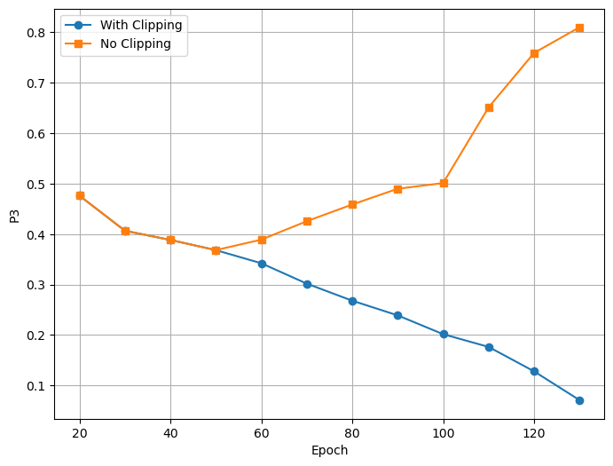

# DL Project
This team project, conducted by Vishnu Sankar, Ilias Baali, Cole Johnson, and Priyanshu Mehta, leverages a Transformer architecture integrated with PINNs to speed up power grid simulations while adhering to physics constraints.

## Table of Contents
- [Why does this Project matter?](#why-does-this-project-matter)
- [Steps to run the transformer model](#steps-to-run-the-transformer-model)
- [Problem Encountered and Strategies Used](#problem-encountered-and-strategies-used)
- [Learnings](#learnings)
- [Results](#results)

## Why does this Project matter?
A single-timestamp of power-flow simulation requires approximately 100 milliseconds. In a day ahead of security assessments,
forecasting over a 24-hour horizon refreshed every 15 minutes involves simulating up to 9000 contingencies ( 90% of
the 10,000 possible node failures) within each quarter-hour window. As energy transition uncertainties drive finer time
discretizations, potentially to 5-minute intervals, the same 5-minute interval permits only <3000 contingency evaluations, leaving the majority of critical failure modes unexamined. Consequently, the execution time of the solver
emerges as a bottleneck that constrains both the breadth and depth of the risk analysis. With power grid topologies and operational regimes becoming increasingly complex, there is an urgent need for faster but equally reliable
simulation techniques capable of supporting comprehensive contingency screening in near real time. That's where deep learning surrogates for power grid analysis comes into play. 

## Steps to run the transformer model
1. Before cloning this repo, and make sure you have the LIPS framework installed in **developer** mode. This can be installed from https://github.com/IRT-SystemX/LIPS/tree/main. Also make sure you have the `ml4physim_startingkit_powergrid` repo from here https://github.com/IRT-SystemX/ml4physim_startingkit_powergrid.git. 

2. Now clone this repo, and copy the `transformer.py` file from transformer_model in this repo to -> `lips\augmented_simulators\tensorflow_models` located inside your LIPS-main directory. This is a baseline model implemented by Nina Inalgad, https://github.com/Ninalgad/powergrid-self-attention in tensorflow. We have adapted, and modified this model for our project. 

3. Copy the `baseline_transformer.py` and place it in the  `ml4physim_startingkit_powergrid` directory

4. Run the `baseline_transformer.py` (epoch = 1), make sure it works fine

5. Run `pinnsformer.py` to train the Physics Informed Transformer model. The code should automatically start downloading the input data if it is not present. Incase the code raises data not found error, then kindly install the data first from https://github.com/IRT-SystemX/ml4physim_startingkit_powergrid/blob/main/2_Datasets.ipynb

## Problem Encountered and Strategies Used
| Challenge           | Strategy                                      |
|---------------------|-----------------------------------------------|
| Rate of converging  | Learning rate schedule with warmup + decay   |
| Diverging issues    | Gradient clipping                             |

## Learnings
Combining a globally expressive architecture (Transformer) with strong physics regularization (PINN) yields models that are both more accurate and more robust. However, they do come at a very high training cost. On average, the training cost is 4–5× higher than other models, even without including all the constraints. If one were to implement the local constraints P6 and P7, the training cost could potentially shoot up further. Though the increased computational burden is expensive, the substantial improvements in physical fidelity and out-of-distribution robustness make PINN-augmented Transformer models a highly promising approach for critical applications where safety, reliability, and physics-consistency are non-negotiable.

## Results
The pinnsformed model reduces the validation error as much as 50% for the current and voltage predictions. In terms of physics compliance, it reduces the error quite significantly compared the baseline model. 

